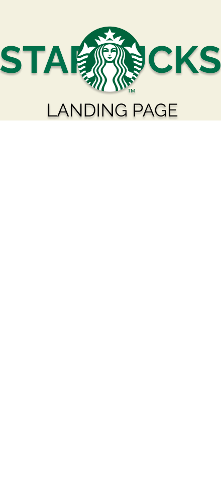

# Landing-Page-Starbucks
aplicación html, css, js para estética de Starbucks
El objetivo es presentar un nuevo producto al prublico mediante una landing page informativa .
## Colores de la marca
Colores primarios de la marca:
- #00704A
- #FFFFFF
- #000000
### Tipografia
La tipografía principal que utiliza Starbucks en su logotipo es Freight Sans y fue creado por Terry Heckler. Sin embargo en esta landing page estaremos utilizando la fuente Raleway.
#### Proposito
Quien: 

- Adultos jóvenes, de entre 18 y 40 años, con un enfoque en la clase media y alta.

Que necesita:

- Alimentos y bebidas hasta necesidades más complejas como un ambiente social y personalizado.

Que ofrece mi producto:

- Informar a los usuarios la salida al mercado de un nuevo producto.

Beneficio final:

- Disfrutar de actualizacion de productos para mejorar la experiencia.
#### Diseño visual
https://www.figma.com/design/TCxEjxNqY3PB65KzKRBmD9/Starbucks?node-id=1-2&t=KNsuiZzXyVxHVcEG-1

